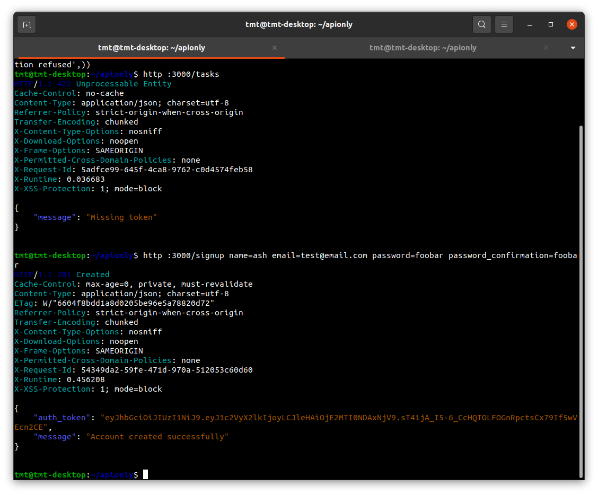
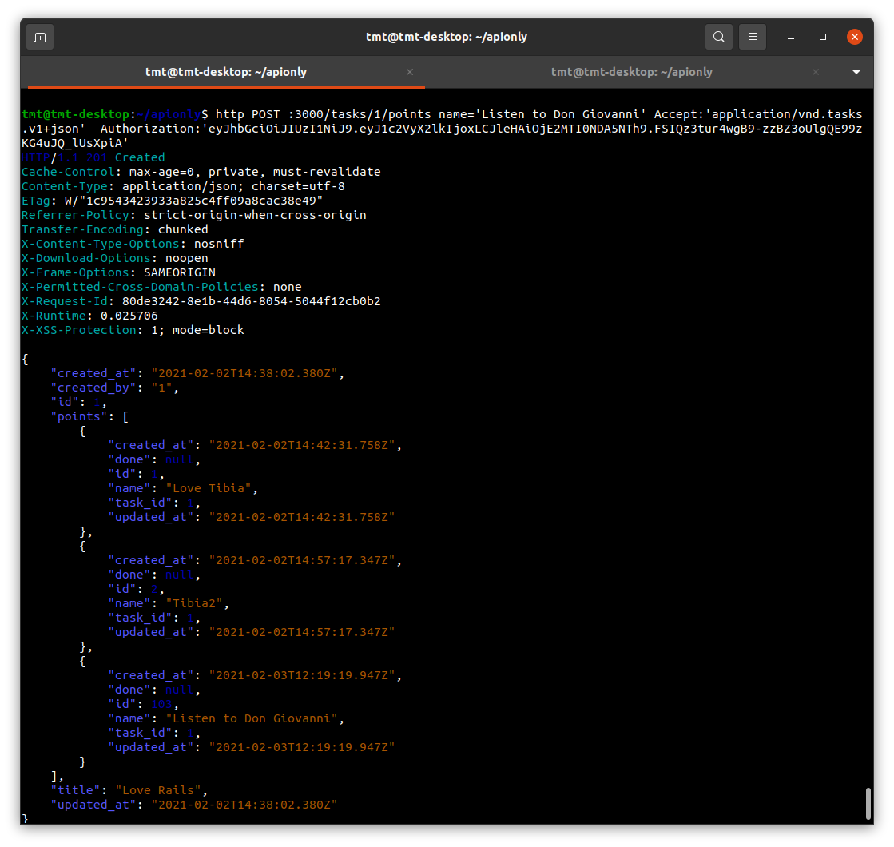

## JSON REST CRUD API - Tasks

---

---

## Stack

*  as language.
*  as framework.
*  as database.
*  for continuous-deployment in production (with always forced SSL connection)
*  for continuous-integration
*  for version control, in this project I have learned branching, pull requests and merging. 
* **RSpec, FactoryBot, Shoulda-Matchers, Guard-RSpec, Database-Cleaner** as test suite stack.
* gem **JWT** as a service for User authentication.
* gem **will_paginate** for pagination.
* gem **active_model_serializers** for Task data serialization.
* gem **bcrypt** for User secure_password.
* gem **rubocop** for static-code-analysis
* gem **brakeman** for security vulnerability checks.
* gem **bundler-audit** for Bundler security verification
* gem **bullet** in development for killing n+1 queries.
* gem **strong_migrations** in development for unsafe migrations.
* gem **better_errors** in development for cleaner errors.
* gem **pry** for debugging.
* gem **faker** for seed sample data.

---

## Run app with HTTPie

`rails s` to run the server

`http :3000/signup name=ash email=test@email.com password=foobar password_confirmation=foobar` to sign-up and get authorization token

`http :3000/auth/login email=test@email.com password=foobar` to log-in

`http :3000/tasks page==2 Accept:'application/vnd.tasks.v1+json' Authorization:'token'` to see all Tasks with pagination and default V1 version

`http POST :3000/tasks/1/points name='Listen to Don Giovanni' Accept:'application/vnd.tasks.v1+json' Authorization:'token'` to post new point of TASK with ID 1

---

## Configuration & dependencies

### System dependencies

`Ruby: 2.7.2p137`

`Rails: 6.0.3.4`

`database: postgresql`

### Configuration

`git clone https://github.com/tmtocb/tasks-JSON-REST-API-TDD`

`bundle install`

### Database

`rails db:drop db:create db:migrate`

`rails db:seed` to seed database with faker data

### Run the app

`rails s`

### Development tools

`binding.pry` to debug

`rubocop` for static-code-analysis

`brakeman` for security vulnerability checks.

`bundler-audit` for Bundler security verification

### Run tests

`rspec` to run full test suite

`guard` for autotests live in development